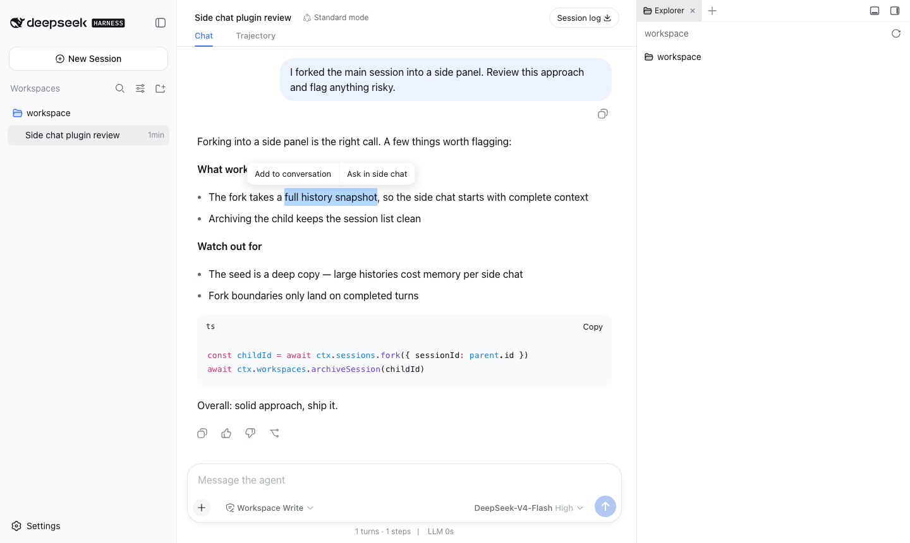
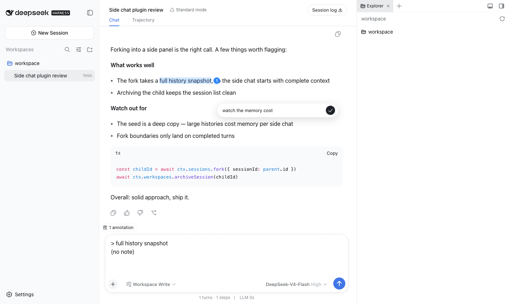
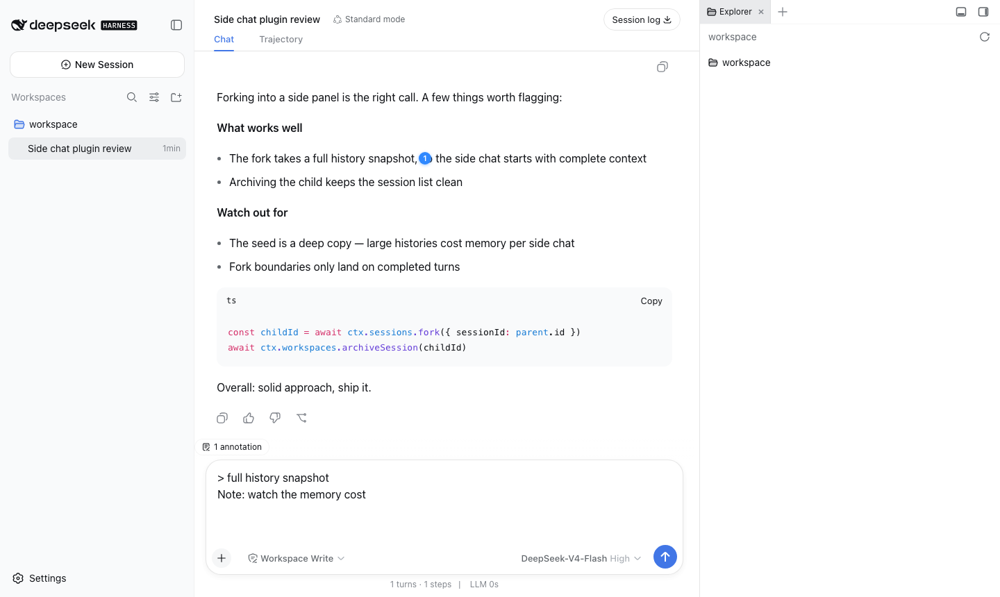

# dsh-sidechat

A [DSH (DeepSeek Harness)](https://github.com/DeepSeek-ai) web plugin: Codex-style **side chat** and **selection annotations**. A thin consumer of [dsh-better-sidebar](https://github.com/omdsh-dev/DSH-better-sidebar), registering its sidebar tabs through the `ctx.betterSidebar` service.

English · [中文](README.md)

## Features

### 💬 Side chat

**Fork** the current main session (full history snapshot) into an independent side session that lives in a「侧边」tab of the right sidebar — keep the main thread moving while you chase side questions:

- Open from the sidebar `+` menu →「侧边聊天」, or the `/side` slash command;
- The fork carries the full main-session context at fork time; afterwards the two sessions evolve independently;
- Multiple side chats coexist («侧边», «侧边 2», …), each closable on its own;
- The model follows the main session's current selection (synced at fork);
- Persistent: restored with the layout across reloads/restarts; hidden from the session list (archived); only closing the tab removes it from the UI.


### 🗒️ Selection annotations

Select text in an assistant message and turn "quote + your note" into context for the model:

- **Add to conversation**: the selection stays highlighted with a blue numbered badge and an optional-note editor; Codex-style reference cards appear above the composer, reveal the full quote on hover, and can be removed with ×;
- **Ask in side chat**: after the note editor, the quote + note lands straight in a side chat's composer;
- Click a badge to reopen the editor (edit/delete); remaining annotations are renumbered to a continuous 1…N after deletion; page-level lifecycle (gone on reload).
- Quotes use DSH's native reference codec and serialize only when sent, so the visible textarea contains neither an expanded `> quote` block nor the internal blue `@reference` placeholder. Removing a card also removes that quote from the pending model context.

| Selection popover | Annotation editor | Badge + chip |
|---|---|---|
|  |  |  |

## Install

### Dependencies

| Dependency | Purpose | Status |
|---|---|---|
| [dsh-better-sidebar](https://github.com/omdsh-dev/DSH-better-sidebar) | Provides the right-sidebar container and tab registration service | Hard dependency of the current release |
| `dsh-annotation-core` | Shared annotation data model, composer bubbles, send binding, model context, and sent-annotation presentation for sidechat and sticker-board | Becomes a hard dependency after the unified-annotation upgrade |

`dsh-annotation-core` is an independently maintained DSH infrastructure plugin; it is not owned by either
sidechat or sticker-board. The installer must place it at the top level of the official `web` profile and load
exactly one instance. Sidechat declares only a compatible peer dependency and must not bundle a nested copy.
If the installed core version is incompatible, installation or upgrade must stop before changing the live
environment and report the required version.

The current `0.1.0-codex.2` release has not yet adopted `dsh-annotation-core`, so its only prerequisite is
[dsh-better-sidebar](https://github.com/omdsh-dev/DSH-better-sidebar). Once the unified-annotation upgrade lands,
the installer or DSH Maintenance Engine will install and enable the matching core automatically; users do not
manage it separately.

```bash
dsh plugin --profile web add dsh-sidechat
```

For local development: `dsh plugin --profile web add link:<path-to-this-repo>` (client changes hot-reload; host changes need a `dsh web` restart).

## Design notes

- **Real fork, no compression**: a side chat is a real DSH session (full-history fork) with the same powers as the main session (tool calls, deeper dives, re-forking) — not a "compress-to-summary one-shot Q&A".
- **List hygiene**: side sessions are archived out of the session list — the list stays clean.
- **Accumulating annotation workflow**: multiple selections stack up as multiple annotations — edit, delete, and send them together; not a one-shot single quote.

## Development

| Command | What it does |
|---|---|
| `pnpm typecheck` | tsc --noEmit |
| `pnpm test` | vitest pure-function unit tests |
| `pnpm build` | type declarations + tsdown (host ESM + client CJS bundle, purity gate) |
| `pnpm test:mount` | mount smoke: scratch profile + fabricated session jsonl + real `dsh web` + Playwright journey lanes (set `BS_VERSION` to test against a different better-sidebar version) |

## License

MIT
