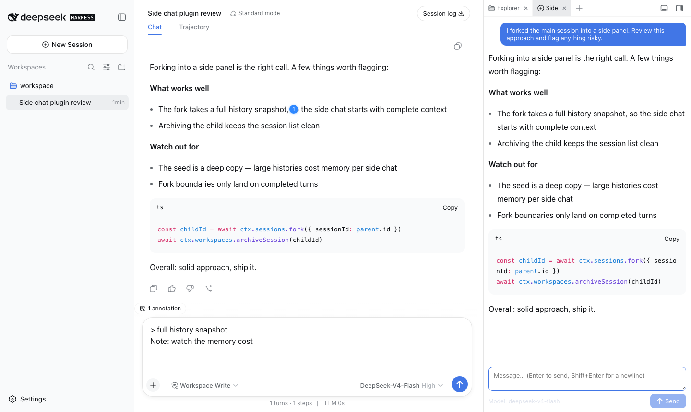

# dsh-sidechat

A [DSH (DeepSeek Harness)](https://github.com/DeepSeek-ai) web plugin: Codex-style **side chat** and **selection annotations**. A thin consumer of [dsh-better-sidebar](https://github.com/omdsh-dev/DSH-better-sidebar), registering its sidebar tabs through the `ctx.betterSidebar` service.

English · [中文](README.md)

## Features

### 💬 Side chat

**Fork** the current main session (full history snapshot) into an independent side session that lives in a「侧边」tab of the right sidebar — keep the main thread moving while you chase side questions:

- Open from the sidebar `+` menu →「侧边聊天」, or the `/side` slash command;
- The fork carries the full main-session context at fork time; afterwards the two sessions evolve independently;
- Multiple side chats coexist («侧边», «侧边 2», …), each closable on its own;
- The model follows the main session's current selection (synced at fork);
- Persistent: restored with the layout across reloads/restarts; hidden from the session list (archived); only closing the tab removes it from the UI.



### 🗒️ Selection annotations

Select text in a user or assistant message and turn it into inspectable, annotatable conversation context:

- **Add to conversation** places a Codex-style annotation bubble above the main composer;
- **Ask in side chat** first resolves the real forked child session, then adds the same bubble to that side chat;
- Open a bubble to inspect the full quote and add an optional comment. Before sending, items can be removed and the remaining numbers close to a continuous 1…N;
- The textarea contains only your question—never expanded `> quote` text, a blue `@`, or a hidden placeholder;
- After sending, the bubble becomes durable conversation history, and “Annotation N” links in the model answer reopen the referenced item.

## Install

### Dependencies

| Dependency | Purpose | Status |
|---|---|---|
| [dsh-better-sidebar](https://github.com/omdsh-dev/DSH-better-sidebar) | Provides the right-sidebar container and tab registration service | Hard dependency of the current release |
| `dsh-annotation-core >=0.1.0 <0.2.0` | Shared annotation bubbles, model context, and sent-annotation presentation | Hard dependency |

Install in this order: core → better-sidebar → sidechat. Each package is installed once at the top level of the official `web` profile:

```bash
dsh plugin --profile web add dsh-annotation-core
dsh plugin --profile web add dsh-better-sidebar
dsh plugin --profile web add dsh-sidechat
```

DSH Maintenance Engine handles that order automatically. If core is missing or incompatible, ordinary side chat remains available while selection-reference actions are disabled.

For local development: `dsh plugin --profile web add link:<path-to-this-repo>` (client changes hot-reload; host changes need a `dsh web` restart).

## Design notes

- **Real fork, no compression**: a side chat is a real DSH session (full-history fork) with the same powers as the main session (tool calls, deeper dives, re-forking) — not a "compress-to-summary one-shot Q&A".
- **List hygiene**: side sessions are archived out of the session list — the list stays clean.
- **One annotation workflow**: the main composer and side chat share the same bubbles, numbering, comments, model context, and history presentation.

## Development

| Command | What it does |
|---|---|
| `pnpm typecheck` | tsc --noEmit |
| `pnpm test` | vitest pure-function unit tests |
| `pnpm build` | type declarations + tsdown (host ESM + client CJS bundle, purity gate) |
| `pnpm test:mount` | mount smoke: scratch profile + fabricated session jsonl + real `dsh web` + Playwright journey lanes (set `BS_VERSION` to test against a different better-sidebar version) |

## License

MIT
